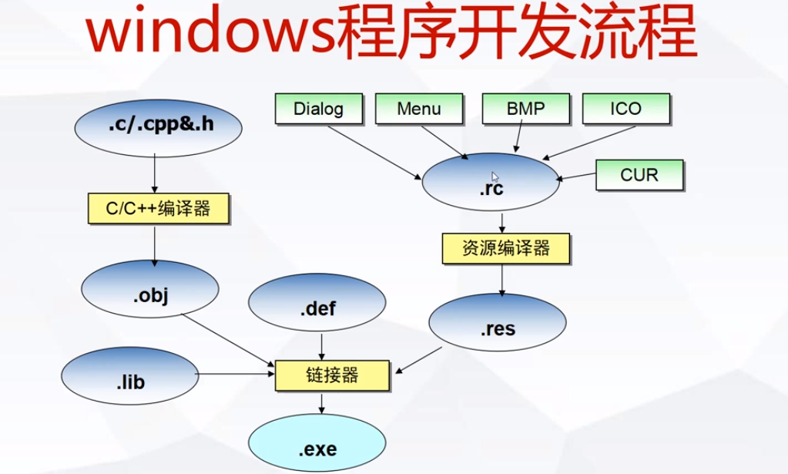
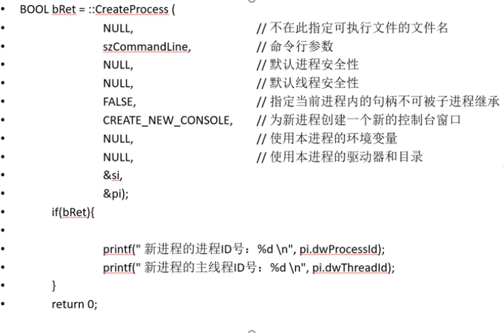
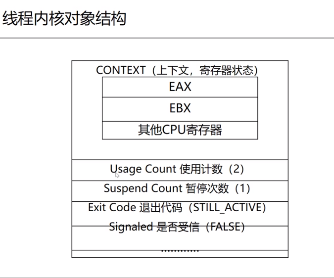
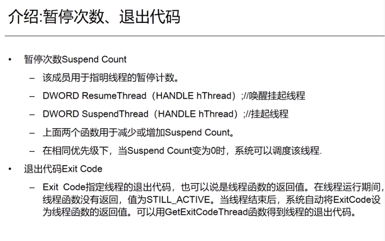
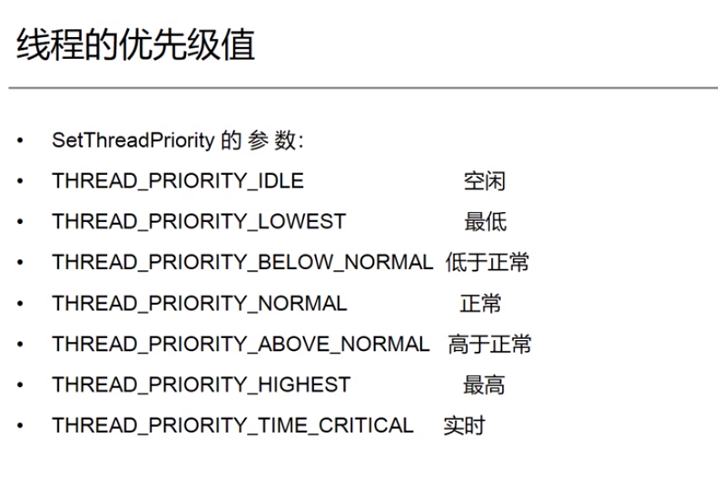
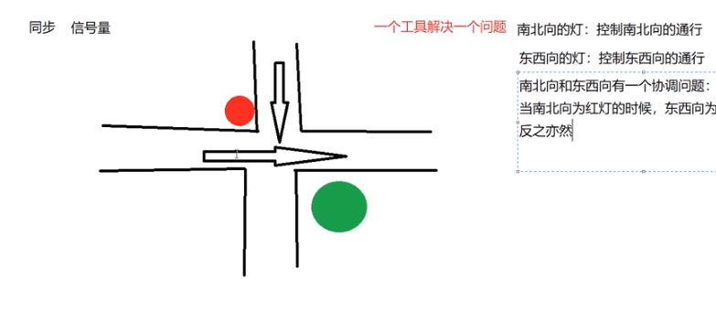
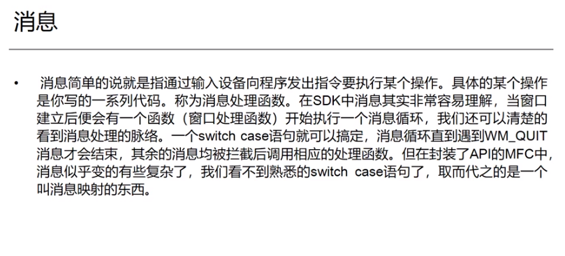
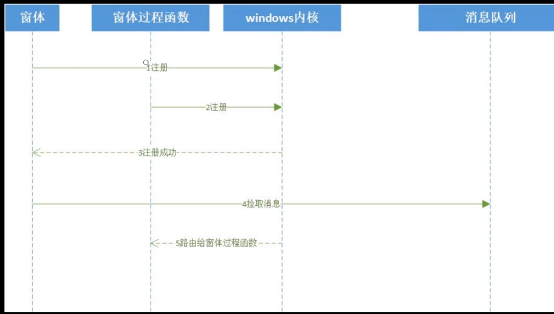
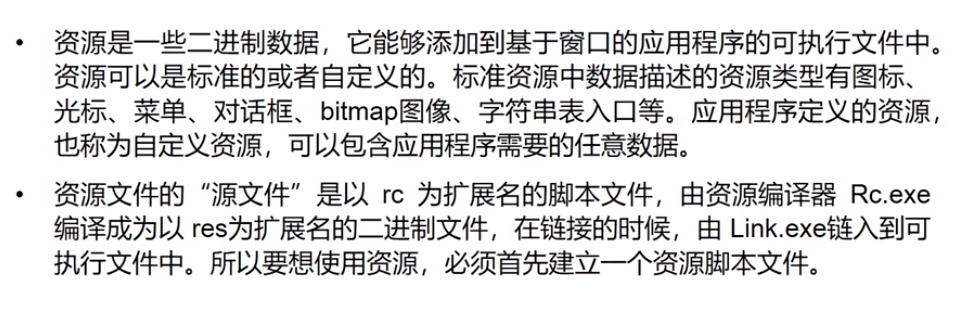

#  Windows 程序设计


>windows 10 + Visual Studio 2017. 

# 1 VC++ 程序设计

课程学习顺序

<center>Windows 编程系列课程

|阶段|课程名称|
|----|-----|
|入门（相当于三年经验）|Windows 程序设计应用开发|
|2| MFC 工程应用与原理剖析|
|3|Windows C/C++ 程序实战视频（10 个案例）|
</center>

此外，我还购买了《VC++ 实战多线程图片编辑器》这门课程。

## 1.2 前期积累及学习资料

曾经入门过 windows 程序设计，并且掌握了基本控件的使用，但是对原理了解不清晰，属于拖控件还不熟练的阶段。关于拖控件，可以看郁金香老师的课程。结合其汇编知识做一些偏底层的程序，如游戏外挂。

书籍方面，经典的《windows程序设计》、**《windows 核心编程》**、《MFC 程序设计》我都是有的，还有一些零散的如《十年 VC++ 老鸟教程》、《VC++ 1200例》。

视频方面，夏曹俊（及丁宋涛）老师的视频为主，搭配郁金香老师的课程。我在教程盘里，存了一些 VC++　经典教程，是书籍并且有固定源码。

PS：百度网盘里还有其它夏曹俊老师的视频教程，网易云课堂里有一门《基于QT的商业软件C++工程实践》。

# 2  Vistual Studio 介绍

>程序员为什么要了解程序从源码到可执行文件的每个过程？

为了调试程序，改 bug 方便。

尽管前几天写了 《借助 gdb 了解编译系统》，这里还是要补充一些其它内容。

首先，预处理就是展开宏及拷贝 .h 头文件，最终得到 .c、.cpp 文件，找不到文件的错误发生在此处。

编译是得到 .s 汇编文件，汇编是生成目标文件 .obj，开发调试中常常视为一个步骤。语法错误检查发生在这个过程，注意：每一个 .cpp 是单独编译的，和其它 .cpp 及其头文件无关。

链接是把 .obj、lib（可能是系统加进去的） 链接为 exe、.dll。

执行涉及 .exe、.dll，前者调用后者。

下图为 Windows 程序开发流程，比上文多了资源 .rc 链接的过程。



vs 创建工程后会产生如图所示4个类型文件，


其中，.vcxproj 是项目文件，基于 xml 显示项目配置等信息，vcxproj.filters 记录的是项目所包含的文件路径，.vcxproj.user 是用户调试路径，一般在项目中都设置为相对路径，不要使用绝对路径，.sln是解决方案文件，Womdows 中一个解决方案可以对应多个项目，且可以设置项目之间的依赖关系，如动态链接库项目。

其它的，.vs、ipch 文件夹是编译产生的缓冲文件，有时候更改项目后编译不过，可以将这两个文件夹手动删掉。

>创建解决方案后的设置

首先对解决方案配置 x64、x86 编译选项，其次对项目进行如下设置：
* 常规 - 输出目录 ..\..\bin
* 项目默认值 - 配置类型、字符集（针对不同字节集内部选择调用不同函数，不改变 vs 源码多字节编码方式）
* 调试 - 工作目录，调试调试的时候的工作路径，为了防止找不到文件，设置与输出目录相同
* C/C++ - 附加包含路径，可以在此设置项目包含的头文件
* 预处理器 - 预处理器定义，就是一些宏定义，便于用作测试
* 链接器 - 常规 - 附加库，路径..\..\lib
* 链接器 - 输入 - 附加依赖项，库的名字 name.lib
  
>调试，相较于 Linux 容易得多

* F9，设置断点
* F10，跳过函数执行下一句
* F11，进入函数内部执行

性能可以观察其它窗口获得信息。
  
# 3 进程

windows 开发要建立起 Windows 内核与用户态的概念，明确程序运行时内核的行为机制，这是相较于以前的 Windows 开发学习自己要掌握的。


操作系统（内核）管理硬件资源，用户程序通过 Win32 API 与内核通信，不能直接操作内核及硬件。

## 3.1 进程初步

>进程如何理解？

调用 CPU 资源的软件手段。进程是正在运行的应用程序的实例。

>进程与程序有何联系、区别？

进程是程序的运行时表示，一个程序运行一次就会获取相应的 CPU 等资源，在内存中具有独立的内存空间。同一个程序可以同时运行，即每个运行的程序都有独立的内存空间，其数据、资源是互相隔离，互不干扰的。

>Windows 进程创建的机制及函数 CreateProcess 的参数说明，调用示例在《Windows核心编程》中有详细的阐述。[]


## 3.2 CPU 保护模式

>关键词：多任务、逻辑空间、MMU 

多道程序并发执行从而诞生保护模式，“保护”指的是进程内存隔离。

启动硬件（BIOS 加电自建）—— 进入实模式-实模式检查存储介质的引导程序 —— 进入 Windows 保护态（借助 CPU 的功能将内存分为核心态和用户态）。

32位 Windows 保护模式下进程的寻址空间是2^32 byte（4GB），Windows 将内存空间划分为核心态和用户态，采用分页技术进行管理，每个页面大小是 4k。

在内存空间中，操作系统按照线性地址编辑，线性地址空间可以理解为逻辑地址，通过 MMU（地址转换单元）映射到不同的物理地址。所以，同时运行一个打印全局变量的程序，该变量都指向同一地址，这与进程隔离机制违背，原因是这个地址属于逻辑地址，通过 MMU 会映射到不同的真实的物理地址空间。

## 3.3 内核对象

创建进程时除了给进程分配一定的内存空间用于存储进程的代码、数据及资源外，还将创建进程内核对象和线程内核对象。

内核对象是系统提供的内核模式下和用户模式下代码间进行交互的基本接口，它是内核分配的内存，只能被内核模式下的代码访问，也叫系统资源。用户态通过 API 访问，没有其它额外的访问方式。

进程和进程的内核对象是两块内存，进程结束，不会把内核对象销毁，后者生命周期不小于前者。关闭进程内核对象，不会影响进程的资源使用，再次证明它们是独立的。

内核对象创建后通常返回内核对象句柄，数据类型是 Handle，它能够定位相应数据结构的位置，它是一个不透明的值，句柄是进程相关的，仅对创建进程有效。

使用计数指明了进程对特定内核对象的引用次数，创建内核对象，引用次数+1，调用 CloseHandle 使用次数减1，当引用计数为0，系统释放此内核对象资源。CreateProcess 会给进程内核对象和线程内核对象都+1，使用结束后如果不执行 CloseHandle,会造成资源泄露。

## 3.4 几个进程相关 API

* CreateToolhelp32Snapshot

获取系统内指定进程的快照
```c++
#include <stdio.h>
#include <windows.h>
#include <TlHelp32.h>

int main(void) {
	PROCESSENTRY32 pe32;
	pe32.dwSize = sizeof(pe32);

	HANDLE hProcessSnap = ::CreateToolhelp32Snapshot(TH32CS_SNAPPROCESS, 0);
	if (hProcessSnap == INVALID_HANDLE_VALUE) {
		printf("Create failure!\n");
		return -1;
	}

	BOOL bMore = ::Process32First(hProcessSnap, &pe32);
	while (bMore) {
		printf("Process Name:%s\n", pe32.szExeFile);
		printf("Process ID:%u\n", pe32.th32ProcessID);
		bMore = ::Process32Next(hProcessSnap, &pe32);
	}

	::CloseHandle(hProcessSnap);
	system("pause");
	return 0;
}
```

* 终止进程

进程终止运行有两种情形，分别是终止自己和终止其它进程。

  * 终止自己 ExitProcess
  
主函数中入口函数返回通过 return 0 就是终止自己。返回时，启动函数调用 exit，并将用户的返回值传给它，exit 销毁所有的全局和静态对象，然后调用 ExitProcess 促使操作系统终止应用程序，终止自己不是停止自己运行，而是申请系统停止对自己的调度。

所有应用程序运行和撤销运行都是内核完成。

调用了该函数，会强制终止运行，会有资源泄露的情况。而且这是 C 风格函数，不会处理 CPP 运行时的概念。

```c++
#include <stdio.h>
#include <windows.h>

class CMyObj {
public:
	CMyObj() {
		printf("Constructor called.\n");
	}
	~CMyObj() {
		printf("Destructor called.\n");
	}
};

int main(void) {
	CMyObj obj;
	//::ExitThread(0)也会有同样的结果
	//这个在第 4 章会讲到
	::ExitProcess(0); 
	return 0;
}
```
  * 终止其它进程 TerminateProcess

```c++
#include <stdio.h>
#include <windows.h>

BOOL TerminateProcessFromId(DWORD dwId) {
	BOOL bRet = FALSE;
	HANDLE hProcess = ::OpenProcess(PROCESS_ALL_ACCESS, FALSE, dwId);

	if (hProcess != NULL) {
		bRet = ::TerminateProcess(hProcess, 0);
	}
	CloseHandle(hProcess);

	return bRet;
}

int main(void) {
	DWORD dwId;
	printf("请输入目标进程号\n");
	scanf("%u", &dwId);
	if (TerminateProcessFromId(dwId)) {
		printf("进程终止成功\n");
	}
	else {
		printf("进程终止失败\n");
	}
	system("pause");
	return 0;
}
```

## 3.5 补充：保证程序的唯一性，隐藏程序控制台

### 3.5.1 保证程序的唯一性
```c++
#include <windows.h>
#include <iostream>
using namespace std;
int main(int argc,char *argv[]) {
	cout << "In this process!" << endl;
	HANDLE hMutex = CreateMutex(NULL, true, L"XONE");
	if (GetLastError() == ERROR_ALREADY_EXISTS) {}
			if (hMutex)
			CloseHandle(hMutex);
		MessageBox(0, L"Xone already runing!", L"", 0);
		return -1;
	}
	getchar();
	return 0;
}
```
### 3.5.2 隐藏程序的控制台

方法一：通过一条宏语句实现
```C++
#pragma comment(linker,"/subsystem:\"windows\" /entry:\"mainCRTStartup\"")
```
方法二：通过项目属性设置
链接器-系统-子系统，切换控制台/窗口，使用窗口，函数入口会发生变化,变为 WinMain,下面例子中的 main 存在的理由就是方便切换回控制台程序，可以根据这样的语法声明、实现其它函数，实现诸如初始化这类操作。

```c++
#include <stdio.h>
#include <windows.h>
//控制台程序 隐藏控制指令
//#pragma comment(linker,"/subsystem:\"windows\" /entry:\"mainCRTStartup\"")
int main();

int WINAPI WinMain(HINSTANCE h, HINSTANCE p, LPSTR cmd, int s) {
	return main();
}
int main() {
	MessageBox(0, L"Console", L"", 0);
	printf("In Console Hide!");
	getchar();
	return 0;
}
```
## 3.6 本章项目：进程内存修改器

程序Tensor,内有两个变量，一个递增，一个递减，找到其中的一个变量，修改它的值，如果修改成功，下次它递增或者递减的起始值就是刚刚设置的值。

思路：为了获取 Tensor.exe 的内部变量的值，需要对 Tensor.exe 运行时的内存具有访问权限，然后搜索它的内存空间，找到要修改的值。程序中根据当前值寻找这个值，可能会有多个值，多个值的情况就打印出所有值的地址，Tensor.exe 继续运行，继续排查，直到找到唯一的确定的值。（多个值的情况则将多个值的地址存储在一个数组，继续寻找的时候，从这个数组里面逐一排查，确保数组里面只有一个元素说明查找结束，要修改的值找到且唯一。）

实现：访问 Tensor.exe 运行时内存，需要创建 Tensor.exe 运行进程。搜索它的内存空间，以 4k 大小为单位逐页搜索，其中 640KB 前的内存用户不能访问，64KB~2GB 是32位系统提供的用户空间，这个程序是以 4K 为递增量逐页搜索。

代码见 github 中名为 Win32 的 repo。


# 4 Win32 多线程处理技术

首先加深下对 Win32 API的认识，它是一个程序库，提供各种各样的与 Windows 系统服务相关的函数。其次，它是最底层的服务，调用 Windows 的各种服务。可以将 Win32 API 看过建立32位系统工作环境的基础材料，这些材料由编制32位程序所必须的一组函数、结构、宏定义构成，任何语言及应用都是建立在 Win32 API 基础上的。

大多数 Win32 API 都封装在3个 DLL 中，kernel.dll、user32.dll、GDI32.dll，这是开发 Windows 应用程序的根本核心，对此越了解越熟练，开发的效率就会越高，在它之上，还有 MFC 对 Win32 API 的封装。

工程应用中，可以将一个函数当作一个线程，一个函数就可以交给CPU分发，因此可以将
业务逻辑封装成线程交给 CPU 分发执行，推进业务的进行。

对3个动态链接库介绍如下：
* kernel.dll 
主要职责：程序加载，上下文选择（理解成保存中断/切换线程的现场及恢复线程现场用到的**寄存器**），文件输入输出，内存管理，比较知名的是 GloBalMemoryStatus 函数显示当前物理内存和虚拟内存的使用信息。

* usr32.dll
窗口、菜单、对话框、图标 

* GDI32.dll
图形输出库，创建图形输出，“画”出窗口、菜单以及对话框，也能保存图形文件。

可以这样讲，我们所写的函数仅仅在 windows.h 中有个签名，他们的实现都在 dll 中,这些实现是作为一个个线程独立运行的。

## 4.1 线程的创建

>进程-主线程-辅助线程 --->> 多线程

进程产生了主线程，主线程中还可以创建新的线程，即多线程。在同进程中运行不同的线程的好处是这些线程可以共享进程的资源，如全局变量、句柄等。各个线程也可以有自己的私有堆栈用于保护私有数据。

一个多线程的应用场景是主线程接受用户的输入，显示运行结果，而创建的新的线程来出来耗时较长的操作。每个线程必须有个进入点函数，线程从这个进入点开始运行。
```c++
#include <stdio.h>
#include <windows.h>

DWORD WINAPI SubThread(LPVOID lpParam) {
    int i = 0;
    while (i < 10) {
        printf("sub thread loop %d.\n", i);
        i++;
    }
    return 0;
}

int main(void) {
    HANDLE hthread;
    DWORD dwThreadId;

    hthread = ::CreateThread(
        NULL,                   //默认的安全属性
        NULL,                   //默认的堆栈
        SubThread,               //线程的入口地址
        NULL,                   //默认的线程参数
        0,                      //线程立即执行（推进到线程就绪系统，通知系统可以调度）
        &dwThreadId
    );

    printf("Main thread will run its subthread,subthread id is %d.\n", dwThreadId);

    system("pause");

    return 0;
}
```

## 4.2 线程的内核对象

每次成功调用 CreateThread 后系统都会在内部为线程分配一个内核对象，内核对象是描述线程状态信息的数据结构，系统提供的管理线程的函数（用户可以调用的管理线程的函数）就是依靠访问线程内核对象来实现线程管理的。


受信只是了线程是否和其它线程进行交互。

下图是一些线程规约，
>线程 = 堆栈 + 寄存器 + 函数


比进程的就绪、运行、阻塞3状态多了两个状态。



## 4.3 线程的终止

C++对象的析构，堆栈释放，内核对象 Exitcode 的值由 STILL_ACTIVE 设置为线程函数的返回值，系统递减线程内核对象的 Usage Code 的值。

线程终止的方法：线程函数自然退出，使用ExitThread 函数终止线程，使用 TerminateThread 函数在一个线程中强制终止另一个线程的执行，使用 ExitProcess 函数结束进程进而结束线程。

后面三个都是 C 风格函数，不调用 C++ 运行时（的机制），会引起没有办法析构全局变量造成的资源泄露的问题。
```c++
#include <stdio.h>
#include <Windows.h>

class MyClass {
public:
    MyClass() {
        printf("constructor called\n");
    }
    ~MyClass() {
        printf("destructor called\n");
    }
};

int main() {
    MyClass obj1;
    ::ExitThread(0);

    system("pause");
    return 0;
}
```

## 4.4 线程的优先级

下图是优先级设定参数。


在用户态中，CPU 有个要保持最大利用率的特性，因此有些短作业、低优先级的线程会比高优先级线程先运行。因此，不要把线程优先级当作绝对概念，在用户态中，这是相对概念，执行的时候 CPU 不会严格遵从优先级定义来调度线程。

```c++
#include <stdio.h>
#include <Windows.h>

DWORD WINAPI ThreadIdle(LPVOID lpParam) {
    for (int i = 0; i < 10; ++i) {
        printf("Idle thread running\n");
    }
    return  0;
}

DWORD WINAPI threadNormal(LPVOID lpParam) {
    for (int i = 0; i < 10; ++i) {
        printf("Normal thread running\n");
    }
    return 0;
}

int main(void) {
    DWORD dwThreadId;
    HANDLE h[2];
    
    h[0] = ::CreateThread (NULL, 0, ThreadIdle, NULL, CREATE_SUSPENDED, &dwThreadId);
    ::SetThreadPriority(h[0], THREAD_PRIORITY_IDLE);
    ::ResumeThread(h[0]);

    h[1] = ::CreateThread(NULL, 0, threadNormal, NULL, 0, &dwThreadId);

    //授信（通知），通知主线程任务完成
    ::WaitForMultipleObjects(
        2,                  //数量
        h,
        TRUE,               //都完成了，才能结束
        INFINITE
    );


    return 0;
}
```
## 4.5 线程同步

### 4.5.1 线程同步的必要性

在实际的开发过程中 一般使用 c/ c++ 运行期函数 beginthreadx 代替 CreateThread 函数（位于<process.h>） 。

使用beginthreadx 首先申请一些用于线程同步的变量，然后调用 CreateThread

使用endthreadex 代替 ExitThread，该函数首先释放用于线程同步的变量，再调
用 ExitThread。

使用全局变量，对其操作观察程序处理的正确性。

线程编程中，要有同步互斥概念。所有线程都是乱序执行的，在线程开发中必须严格限制程序指令序列的推进（汇编级）。否则，就会造成程序运行结果的不可预料。

### 4.5.2 访问静态资源及线程同步的机制

* 临界区对象

```c++
#include <stdio.h>
#include <process.h>
#include <windows.h>

int g_Cnt = 0;
//全局临界区
CRITICAL_SECTION g_cs;


UINT __stdcall ThreadFunc(LPVOID);
BOOL bFlag = FALSE;

int main(void) {
    UINT uId;
    HANDLE h[2];
    
    ::InitializeCriticalSection(&g_cs);

    h[0] = (HANDLE)::_beginthreadex(NULL, 0, ThreadFunc, NULL, 0, &uId);
    h[1] = (HANDLE)::_beginthreadex(NULL, 0, ThreadFunc, NULL, 0, &uId);
    //主线程休息1000ms,让出CPU的使用权，让我们辅助线程有机会运行
    bFlag = TRUE;
    Sleep(1000);
    bFlag = FALSE;

    ::WaitForMultipleObjects(2, h, TRUE, INFINITE);
    
    CloseHandle(h[0]);
    CloseHandle(h[1]);

    ::DeleteCriticalSection(&g_cs);

    printf("g_Cnt=%d\n", g_Cnt);
    system("pause");
    return 0;
}
//线程的编程的重点：与时间有关的错误
UINT __stdcall ThreadFunc(LPVOID) {
    if (bFlag) {
        //::EnterCriticalSection(&g_cs);

        for (int i = 0; i < 10000; i++)
            ////g_Cnt++;                          
            //将 g_Cnt++ 替换为 互锁函数
            ::InterlockedIncrement((long*)&g_Cnt);  

        //::LeaveCriticalSection(&g_cs);
    }
    return 0;
}

```

* 互锁函数

锁会降低程序的推进效率，低于无锁、InterlockedIncrement（Windows 提供）,所以程序设计时需要考虑即要兼顾并发，又要保证结果的一致。
```c++
//锁导致程序的推进效率降低，两个值相同但是变小了

#include <stdio.h>
#include <process.h>
#include <windows.h>

int g_Cnt_1 = 0;
int g_Cnt_2 = 0;

//全局临界区

CRITICAL_SECTION g_cs_1;


UINT __stdcall ThreadFunc1(LPVOID);
BOOL bFlag1 = FALSE;

int main5(void) {
    UINT uId;
    HANDLE h[2];

    ::InitializeCriticalSection(&g_cs_1);

    h[0] = (HANDLE)::_beginthreadex(NULL, 0, ThreadFunc1, NULL, 0, &uId);
    h[1] = (HANDLE)::_beginthreadex(NULL, 0, ThreadFunc1, NULL, 0, &uId);
    //主线程休息1000ms,让出CPU的使用权，让我们辅助线程有机会运行
    bFlag1 = TRUE;
    Sleep(1000);
    bFlag1 = FALSE;
    ::WaitForMultipleObjects(2, h, TRUE, INFINITE);
    CloseHandle(h[0]);
    CloseHandle(h[1]);

    ::DeleteCriticalSection(&g_cs_1);
    //值应该相同
    printf("g_Cnt_ = %d,g_Cnt_2 = %d\n", g_Cnt_1,g_Cnt_2);
    system("pause");
    return 0;
}

//线程的编程的重点：与时间有关的错误
UINT __stdcall ThreadFunc1(LPVOID) {
    while (bFlag1) {
        ::EnterCriticalSection(&g_cs_1);
        g_Cnt_1++;
        g_Cnt_2++;
        ::LeaveCriticalSection(&g_cs_1);
    }
    return 0;
}
```
* 信号量同步机制（事件内核对象）

示例是线程交叉执行打印
```c++
//线程同步，线程A、B交替打印字母
#include <stdio.h>
#include <windows.h>
#include <process.h>


HANDLE g_hEventA, g_hEventB;

UINT __stdcall thread1(LPVOID) {
    while (TRUE) {
        WaitForSingleObject(g_hEventA, INFINITE);
        printf("A\n");
        SetEvent(g_hEventB);
        Sleep(200);
    }
    return 0;
}

UINT __stdcall thread2(LPVOID) {
    while (TRUE) {
        WaitForSingleObject(g_hEventB, INFINITE);
        printf("B\n");
        SetEvent(g_hEventA);
        Sleep(200);
    }

    return 0;
}

int main(void) {
    HANDLE h[2];
    h[0] = (HANDLE)_beginthreadex(NULL,0,thread1,NULL,0,NULL);
    h[1] = (HANDLE)_beginthreadex(NULL, 0, thread2, NULL, 0, NULL);

    g_hEventA = CreateEvent(NULL, FALSE, TRUE, NULL);
    g_hEventB = CreateEvent(NULL, FALSE, FALSE,NULL );

    WaitForMultipleObjects(2, h, TRUE, INFINITE);

    system("pause");
  
    return 0;
}
```

## 4.6 VC++ 多线程实战图片编辑器

### 4.6.1 线程如何理解

>线程可以看作是操作系统分配给 CPU 时间（时间片）的基本单位。

在 Windows 中，操作洗头膏创建了进程后，会创建主线程，然后由主线程创建其它子线程，一个进程的所有线程共享虚拟地址空间、全局变量及该进程的操作系统资源。Linux 中不需要为进程创建主线程获取 CPU 时间片，因此 Linux 中可以有多进程编程这种比较复杂的编程模式，需要用到 socket、信号量等通信机制，而多线程的通信通过变量就可以完成操作。

当进程被终止时，主线程也同时被终止，当主线程消亡时后，其子线程也同时消亡。但是在实际开发中经常发现主线程结束后，子线程没有结束，操作系统没有结束子线程，甚至出现不能释放子线程的情况。为了应对这种情况，在创建子线程的时候，一定要设置子线程的结束条件，不要依赖系统结束子线程，防止产生资源泄露及其它错误。

### 4.6.2 [线程类的封装](./xthread_platform)

一个对象代表新创建一个线程，一个线程对象本身是没有意义的，一定要设置一个工作函数指明线程所要进行的操作，即 usr_define_task(),声明为纯虚函数。这样直接子类对象会被提示实现 usr_define_task 函数。

不能把 usr_define_task 函数声明为线程的入口函数，即 _beginthread() 的第一个参数所需要的参数，这样会：1 破坏了封装，线程对象只能完成单一工作，而不同的任务要频繁更改基类的代码，没有发挥 OOP 的优势；2 报错，_beginthread 函数要求的实参类型函数原型是 void func(void*),在类中定义的函数的类型则属于 void (xthread:: *)( void*)，二者矛盾。正确的做法是在 xthread 的实现文件中声明一个静态函数作为线程函数入口函数（静态保证了只能在本 .cpp 文件中访问，不会被其它文件调用对数据进行非法操作），类内函数 start 负责线程的创建，进入该静态函数，在该静态函数中调用usr_define_task() 处理数据，并且在该静态函数内部结束线程。在子类继承后，重写 usr_define_task 函数实现。


### 4.6.3 线程类的挂起和恢复

挂起和恢复在实际应用中，除非是一开始适当的挂起，然后一起启动。正常情况下不太用这些功能，因为挂起的时候无法确定线程执行到哪里，在其它线程中调用函数挂起线程时可能被挂起的线程刚刚得到互斥资源，挂起后资源不释放，导致未知的错误。

### 4.6.4 线程同步

互斥访问静态资源或者互斥执行操作，操作不可打断。几乎是效率最高的线程同步方法。这部分封装了一个 xmutex 类，将临界区的初始化、进入、退出、删除返还系统这些操作都封装，这个例子很好地体现了　C++　面向对象封装的方便之处，需要好好消化。另外，同一个项目中有多个 main 函数用于不同实验的时候，在编译时除了保留一个 main 外，需要注意其它文件是不是定了同名称的子类、函数，编译时编译器不一定会采用 main 函数所在文件的定义，会造成莫名奇妙的错误，难以排查，最好将其它无关文件注释掉。

### 4.6.5 C++11 中的线程类

一般的线程启动、互斥已经有了定义，复杂的操作还需要借助系统 API 完成，另外，对于互斥、临界区的使用，遵循“晚使用，早退出”的原则，因为这类操作需要额外的系统开销，上述原则能保证系统开销最小。另外，早早地用 C++11 的 lock() 会出现找不到互斥操作变量的错误，在变量操作前使用 lock() 即可更正这类错误。

## 4.6.6 Qt多线程图片处理

[单线程版本](./qt_image_single_thread)、[多线程版本](./qt_image_multi_thread)


# [5 MFC 入门示例(4个)](./ch0_4_mfc_examples/)

* RegEdit

注册表修改程序，能够打开注册表，查看根键、子键的值。创建新的子键并且设置它的值，也可以删除子键及子键的值。
* add  

基本对话框程序，演示如何使用 Edit 控件，Button 控件及MFC自带的 CString 类。
 
* MFC 中使用控制台

添加 consoleInMfc.cpp to the MFC (Dialog base) 项目.在 xxDlg.cpp 文件及所在项目中进行如下操作：
    
1. add "# include <istream> ";   
2. and a button.in function on button add "cout<<""<<endl;";   
3. set Project-Setting-Link-sbusystem:windows as subsystem:console;   

执行程序。

* CFile 

CString 类型存储文件名、写入文件内容，储存读取的文件内容（PS： 该实现有 bug）。

<center>
MFC 中的数据类型


|    |     |
|:--:|:---:|
| BOOL     |      TRUE | FALSE
| BSTR     |      32 BIT CHAR POINTER
| BYTE     |      8 BIT ,likes unsigned char in c
| COLORREF |      32BIT DESCRIBE COLOR,USED IN GDI
| DWORD    |     32BIT UNSINGNED INT
| LONG     |     32BIT INT (+ -)
| LPARAM   |     32BIT ,OFFTEN USED FOR FUNCTION'S Parameters
| LPCSTR   |     POITER TO 32BIT CONST STR
| LPSTR    |     POITER TO 32BIT STR
| LPCTSTR  |     POITER TO 32BIT CONST STR,Used for Unicode and DBCS
| LPTSTR   |     POITER TO 32BIT STR,USED for Unicode and DBCS
| LPVOID   |     POITER TO ANY TYPE
| LRESULT  |     window process or 32bit value callback function returns
| UINT     |     32BIT UNSIGNED INT
| WNDPROC  |     32BIT POITER TO WINDOWS FUNCTION
| WORD     |     16BIT UNSIGNED INT
| WPARAM   |     32BIT VALUE IN WIN32,OFTEN AS FUNCTION'S PARAMETERS
| POSITION |     POSITION OF ELEMENT IN SET
| LPCRECT  |     32BIT POITER TO A CONST RECT STRUCT

</center>

> PS: 最后两个是 MFC　独有的。

## [动态链接库初步](./dll_create_test/)

配合这篇[博文](https://hanxinle.github.io/post/code/vc6dll.html)阅读,本科毕业设计曾在 VC++6.0 上面实现过 dll，现在用 vs2017 实现，细节有不同但是大思路是一致的，遵循“定义 - 导出 - 调用” 原则。

在 vs2017 动态链接库项目中，自己以前经常程序莫名崩溃，一个原因是在解决方案中没有设置项目依赖关系，另一个原因是在 dll 项目中，需要在“项目属性-链接器-高级-导入库”中进行设置，导出 lib、dll 文件，使用时包含头文件，并且配置好包含路径、库路径、执行路径（dll  所咋路径）就不会再出错了。

# 6 windows sdk GUI编程

## 6.1 消息及消息驱动


Windwos GUI 是消息驱动程序，一个 GUI 在 Windows 中可以视作一个进程。它也有窗口句柄，可以有子线程，WinMain 函数的后两个参数是 CreateProcess 的参数指定的。

windows 消息驱动机制：操作系统通过发送消息给 GUI 程序响应用户的操作。GUI 程序可以根据接收的消息，执行相应的操作，消息的发送方是操作系统，不是用户。Windows 向程序发送消息的时候，调用一个函数精确地描述了消息地信息。程序中，接收消息并处理地函数，是一个自定义的回调函数，它的原形如下：

```c++
LRESULT CALLBACK WindowProc (HWND hwnd, 
                            UINT uMsg,
                            WPARAM wParam,
                            LPARAM IParam )
```

## 6.2 Windows Dialog 创建及工作机制

win32 创建窗口的过程有如下3个步骤，首先，注册窗口，设置属性，接着，创建窗口、现实并刷新，最后定义消息处理函数，接收消息并处理。注册窗口的时候，将消息处理函数、类名、实例绑定等工作已经完成。



第一次注册 wndclass，第二次注册回调函数 MainWndProc 处理消息，关于消息和消息的类别，有3类，Windows 消息、控件消息、命令消息。三类消息都在 Windows 消息队列中，由 Windows 内核调度分发（不是用户）。Windows 编程就是针对消息编程，完成了对消息的响应的编程，就是完成了上层应用。这就是对 Windows 消息处理框架的解释。

```c++
#include <stdio.h>
#include <windows.h>
LRESULT CALLBACK MainWndProc(HWND, UINT, WPARAM, LPARAM);

int APIENTRY WinMain(HINSTANCE hInstance, HINSTANCE hPrevInstance,
                     LPSTR lpCmdLine, int nCmdShow) {

    //注册窗口类
    char szClassName[] = "MainWClass";
    WNDCLASSEX wndclass;

    wndclass.cbSize = sizeof(wndclass);
    wndclass.style = CS_HREDRAW | CS_VREDRAW;
    wndclass.lpfnWndProc = MainWndProc;
    wndclass.cbClsExtra = 0;
    wndclass.cbWndExtra = 0;
    wndclass.hInstance = hInstance;
    wndclass.hIcon = ::LoadIcon(NULL, IDI_APPLICATION);
    wndclass.hCursor = ::LoadCursor(NULL, IDC_ARROW);
    wndclass.hbrBackground = (HBRUSH)::GetStockObject(WHITE_BRUSH);
    wndclass.lpszMenuName = NULL;
    wndclass.lpszClassName = szClassName;
    wndclass.hIconSm = NULL;

    ::RegisterClassEx(&wndclass);

    //创建主窗口
    HWND hWnd = ::CreateWindowEx(0,
                                 szClassName,//类名
                                 "我的第一个GUI程序",
                                 WS_OVERLAPPEDWINDOW,
                                 CW_USEDEFAULT,
                                 CW_USEDEFAULT,
                                 CW_USEDEFAULT,
                                 CW_USEDEFAULT,
                                 NULL,
                                 NULL,
                                 hInstance,
                                 NULL
    );
    if (NULL == hWnd) {
        ::MessageBox(NULL, "创建窗口失败", "错误", MB_OK);
        return -1;
    }

    //显示窗口
    ::ShowWindow(hWnd, nCmdShow);
    ::UpdateWindow(hWnd);

    //从操作系统的消息队列中不断的捡取消息
    MSG msg;
    while (::GetMessage(&msg, NULL, 0, 0)) {
        ::TranslateMessage(&msg);
        ::DispatchMessage(&msg);
    }
    return msg.wParam;
} 

LRESULT CALLBACK MainWndProc(HWND hWnd, UINT message, WPARAM wparam, LPARAM lparam) {
    switch (message) {
    case WM_DESTROY:
        ::PostQuitMessage(0);
        return 0;
    }
    return ::DefWindowProc(hWnd, message, wparam, lparam);
}
```

## 6.3 示例

资源是一些二进制数据，用 .rc 这一脚本格式记录，Windows 用 rc.exe 将其编译为 .res 文件，可以通过链接器添加到可执行文件。



### 6.3.1 示例1，创建窗口，处理键鼠消息，计时器使用

### 6.3.2 示例2：石头剪刀布游戏，按钮及消息处理

### 6.3.3 其它3个用户界面编程案例（应用 Windows 提供的模板、控件）